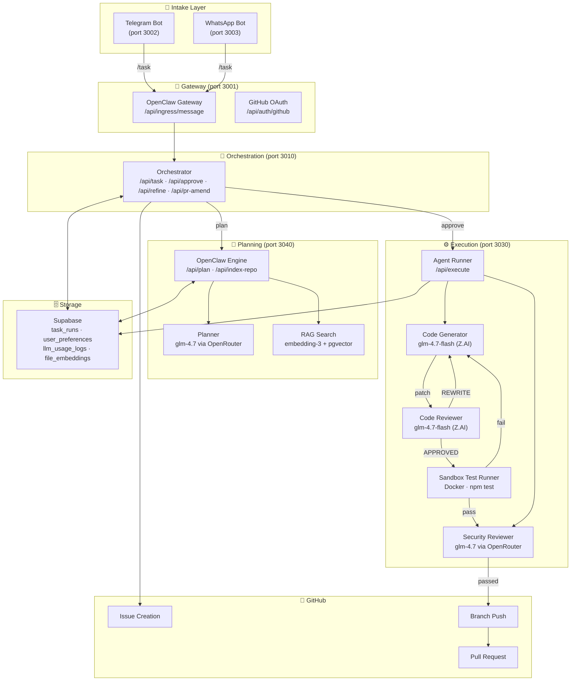

# DevClaw

> **Turn a Telegram or WhatsApp message into a merged GitHub pull request — no IDE, no manual steps, no waiting.**

DevClaw is a **production-ready multi-agent AI coding system** powered entirely by the **Z.AI GLM model family**. Describe a task in plain English, approve an architecture plan, and DevClaw writes, reviews, secures, tests, and ships the code — automatically.

---

## Z.AI GLM — The Entire Model Ecosystem, Matched to Cognitive Demand

Every agent in DevClaw runs a Z.AI GLM model. Models are chosen by the cognitive complexity of each role:

| Agent Role | GLM Model | Route | Capability Used |
|---|---|---|---|
| Architecture Planner | `glm-4.7` | OpenRouter | Long-context repo analysis, structured JSON planning |
| Workflow Orchestrator | `glm-4.7` | OpenRouter | Complex multi-step state reasoning |
| Code Generator | `glm-4.7-flash` | Direct Z.AI API | Fast iterative code generation with CoT streaming |
| Code Reviewer | `glm-4.7-flash` | Direct Z.AI API | Independent quality scoring + REWRITE notes |
| Frontend Generator | `glm-4.7-flash` | Direct Z.AI API | Specialised React/CSS/UI generation |
| Backend Generator | `glm-4.7-flash` | Direct Z.AI API | Specialised API/DB/service generation |
| Security Reviewer | `glm-4.7` | OpenRouter | OWASP Top 10 vulnerability scanning of diffs |
| Embedding | `embedding-3` | Direct Z.AI API | Semantic file search (RAG/pgvector) |

**Fallback strategy:** every OpenRouter call falls back to `glm-4.7-flash` via direct Z.AI API. DevClaw never leaves the GLM family.

---

## Architecture



---

## The Full Pipeline

```
User (Telegram / WhatsApp)
  │  /task Add dark mode to the settings page
  ↓
OpenClaw Gateway (port 3001)
  │  route to orchestrator + authenticate
  ↓
Orchestrator (port 3010)
  │  create GitHub issue
  │  clone repo → OpenClaw Engine
  │
  ├─ RAG Index (embedding-3, pgvector) ← repo files
  │
  ↓
Architecture Planner — glm-4.7 (128k+ ctx)
  │  JSON plan: files, domain assignments, risk flags
  ↓
User approves plan  ←→  Telegram / WhatsApp
  │  /approve plan-abc123
  ↓
Agent Runner — per sub-task (frontend / backend):
  │
  ├── Code Generator (glm-4.7-flash) → code patch
  ├── Code Reviewer  (glm-4.7-flash) → APPROVED | REWRITE
  │       if REWRITE → Generator again (up to 3 iterations)
  ├── Sandbox Test Runner (Docker)   → npm build + npm test
  │       if FAIL   → Generator again with stderr as context
  └── Security Reviewer (glm-4.7)   → OWASP Top 10 scan
          if BLOCKED → notify user, mark security_blocked
  │
  ↓  all sub-tasks: approved + tested + secured
GitHub Client → branch push → PR opened
  │
User (Telegram / WhatsApp)  ←  "✅ Code is ready! Branch: ..."
  │
  └── /amend plan-abc123 [instructions]  → amend commits pushed
```

---

## Five Production-Grade Features

### 1. Agentic Generator → Reviewer Loop
The Generator/Reviewer pair repeats per sub-task until the Reviewer says `APPROVED` or max iterations are hit. Reviewer notes are injected into the next generation prompt so the model self-corrects.

### 2. Sandbox Auto-Test Loop
After each Reviewer approval, DevClaw runs `npm install && npm run build && npm test` inside an ephemeral Docker container. If tests fail, the stderr is fed back to the Generator as context for another iteration. Set `SANDBOX_ENABLED=false` to skip.

### 3. Security Gate (OWASP Top 10)
Before any branch push, a dedicated `glm-4.7` security reviewer scans the full diff for SQL injection, XSS, IDOR, hardcoded secrets, and 7 more OWASP categories. Critical/high findings block the push and send a detailed alert to the user. Set `SECURITY_SCAN_ENABLED=false` to skip.

### 4. Conversational PR Refinement
After a PR branch is pushed, users can send `/amend <planId> <instructions>` to push additional commits to the same branch — no new task needed. Works on both Telegram and WhatsApp.

### 5. Semantic Repository Search (RAG + pgvector)
Before planning, DevClaw embeds repo files using Z.AI's `embedding-3` model and stores them in Supabase pgvector. When a new task arrives, the top-k most relevant file snippets are retrieved via cosine similarity and injected into the planner prompt — making the plan dramatically more accurate for large codebases.

---

## Analytics Dashboard

The monitoring dashboard (`apps/dashboard/`) shows:
- Active/completed/failed task counts
- **GLM Usage Analytics** — total tokens, estimated cost per role, calls per provider
- Real-time task history with PR links
- Agent pipeline steps and model map

All token usage is logged to `llm_usage_logs` in Supabase with estimated USD cost based on Z.AI's published rates.

---

## Quick Start

### Prerequisites

- Node.js 20+, npm 10+
- **Z.AI API key** (`open.bigmodel.cn`) — required for GLM generation + embedding
- **OpenRouter API key** — for `glm-4.7` planning + security reviewer
- GitHub personal access token (repo + issues scope)
- Telegram bot token (from @BotFather)
- Supabase project (PostgreSQL with pgvector enabled)
- Docker (for sandbox test runner — optional, gracefully skipped if absent)

### Install

```bash
git clone https://github.com/your-org/devclaw
cd devclaw
npm install
```

### Configure

```bash
cp services/orchestrator/.env.example services/orchestrator/.env
cp services/agent-runner/.env.example services/agent-runner/.env
cp services/openclaw-gateway/.env.example services/openclaw-gateway/.env
cp apps/telegram-bot/.env.example apps/telegram-bot/.env
```

Key variables:

```env
# Z.AI — core GLM inference engine
ZAI_API_KEY=your_zai_api_key
ZAI_BASE_URL=https://open.bigmodel.cn/api/paas/v4

# OpenRouter — planner + orchestrator + security reviewer
OPENROUTER_API_KEY=your_openrouter_key

# GitHub
GITHUB_TOKEN=your_github_pat
GITHUB_APP_ID=your_github_app_id
GITHUB_PRIVATE_KEY=your_github_private_key

# Telegram
TELEGRAM_BOT_TOKEN=your_bot_token

# Supabase
SUPABASE_URL=https://your-project.supabase.co
SUPABASE_SERVICE_ROLE_KEY=your_service_role_key

# Feature flags (all default ON)
SECURITY_SCAN_ENABLED=true
SANDBOX_ENABLED=true
RAG_ENABLED=true
ANALYTICS_ENABLED=true
```

### Supabase Schema

Run once in the Supabase SQL editor:

```sql
-- pgvector for RAG
CREATE EXTENSION IF NOT EXISTS vector;

-- LLM usage analytics
CREATE TABLE IF NOT EXISTS llm_usage_logs (
  id          uuid PRIMARY KEY DEFAULT gen_random_uuid(),
  created_at  timestamptz NOT NULL DEFAULT now(),
  run_id      text,
  request_id  text,
  role        text NOT NULL,
  provider    text NOT NULL,
  model       text NOT NULL,
  tokens_used integer,
  cost_usd    numeric(12, 8),
  latency_ms  integer
);

-- File embeddings for RAG search
CREATE TABLE IF NOT EXISTS file_embeddings (
  id          uuid PRIMARY KEY DEFAULT gen_random_uuid(),
  created_at  timestamptz NOT NULL DEFAULT now(),
  repo        text NOT NULL,
  file_path   text NOT NULL,
  content     text NOT NULL,
  embedding   vector(1536),
  UNIQUE (repo, file_path)
);

CREATE INDEX IF NOT EXISTS file_embeddings_embedding_idx
  ON file_embeddings USING ivfflat (embedding vector_cosine_ops)
  WITH (lists = 100);

-- RAG similarity search function
CREATE OR REPLACE FUNCTION match_file_embeddings(
  query_embedding vector(1536),
  match_repo      text,
  match_count     int DEFAULT 10
)
RETURNS TABLE(file_path text, content text, similarity float)
LANGUAGE sql STABLE AS $$
  SELECT file_path, content,
         1 - (embedding <=> query_embedding) AS similarity
  FROM file_embeddings
  WHERE repo = match_repo
  ORDER BY embedding <=> query_embedding
  LIMIT match_count;
$$;

-- Add branch_name column to task_runs (if not already present)
ALTER TABLE task_runs ADD COLUMN IF NOT EXISTS branch_name text;
```

### Run

```bash
# All services
npm run dev

# Core services only
npm run dev:servers
```

---

## Bot Commands

| Command | Description |
|---|---|
| `/login` | Link your GitHub account via OAuth |
| `/repo owner/repo` | Set your active repository |
| `/task <description>` | Create a new coding task → architecture plan |
| `/approve <planId>` | Approve the plan and start code generation |
| `/refine <planId> <notes>` | Request plan adjustments before approval |
| `/reject <planId>` | Cancel the current plan |
| `/amend <planId> <instructions>` | Push additional commits to an existing branch |
| `/repos` | List your accessible GitHub repositories |
| `/status` | Check your linked repo and GitHub connection |
| `/help` | Show available commands |

---

## Monorepo Structure

```
apps/
  landing-page/     React + Vite + Tailwind — marketing site
  dashboard/        Monitoring dashboard (task history, GLM analytics)
  telegram-bot/     Telegram intake + proactive notifications
  whatsapp-bot/     WhatsApp intake + proactive notifications

services/
  openclaw-gateway/ Central ingress gateway — routes messages, GitHub OAuth
  orchestrator/     Task lifecycle: intake → planning → approval → execution
  openclaw-engine/  Architecture planning (GLM planner + RAG indexer)
  agent-runner/     Generator/Reviewer loop + sandbox tests + security gate

packages/
  llm-router/       Z.AI GLM routing — streaming SSE, retries, fallback, analytics
  contracts/        Shared TypeScript interfaces
  github-client/    Octokit wrapper (issues, branches, PRs)
  config/           Shared configuration helpers
```

---

## LLM Router

`packages/llm-router/` is the Z.AI integration layer:

- **Provider routing** — maps agent roles to models and routes to Z.AI or OpenRouter
- **Streaming SSE** — parses GLM's two-phase `reasoning_content → content` stream
- **Retries + fallback** — per-role policy: timeout, HTTP 5xx, 429 all eligible for fallback
- **Usage logging** — every call is logged to Supabase with token count, latency, and estimated cost
- **Embedding** — `callZaiEmbedding()` uses Z.AI's `embedding-3` model for RAG

```typescript
import { chat, callZaiEmbedding } from '@devclaw/llm-router';

// Chat (any GLM role)
const reply = await chat({
  role: 'generator',
  messages: [{ role: 'user', content: 'Add a rate limiter to this Express route...' }],
  requestId: 'run-abc-123',
});

// Semantic embedding
const vector = await callZaiEmbedding('database connection pooling logic');
```

---

## Tech Stack

| Layer | Technology |
|---|---|
| AI Models | Z.AI GLM-4.7-flash (gen/review), GLM-4.7 (plan/orchestrate/security), embedding-3 (RAG) |
| AI Routing | Custom LLM router — streaming SSE, retries, fallback, analytics |
| Messaging | Telegram Bot API, WhatsApp Web.js |
| Sandbox | Docker (ephemeral containers, network isolation) |
| Vector Search | Supabase pgvector + Z.AI embedding-3 |
| GitHub | Octokit REST API (issues, branches, PRs) |
| Backend | Node.js + Express + TypeScript |
| Frontend | React + Vite + Tailwind CSS |
| Database | Supabase (PostgreSQL + pgvector) |
| Monorepo | Turborepo + npm workspaces |

---

## Z.AI Hackathon — Production-Ready AI Agents

DevClaw demonstrates deep, production-grade usage of Z.AI's complete model ecosystem:

- **8 distinct GLM model invocations** — each matched to cognitive complexity
- **Two-phase streaming** — real-time `reasoning_content → content` SSE parsing
- **Z.AI embeddings** — `embedding-3` powering semantic file search via pgvector
- **Agentic self-correction** — Generator/Reviewer loops with injected reviewer notes
- **Multi-agent coordination** — Planner, Orchestrator, Generator, Reviewer, Security Reviewer all coordinate
- **Resilient routing** — automatic fallback stays 100% within the GLM family
- **Real production output** — actual GitHub branches, commits, and pull requests on real repositories
- **Quantified cost tracking** — every GLM call logged with token count and estimated USD cost
